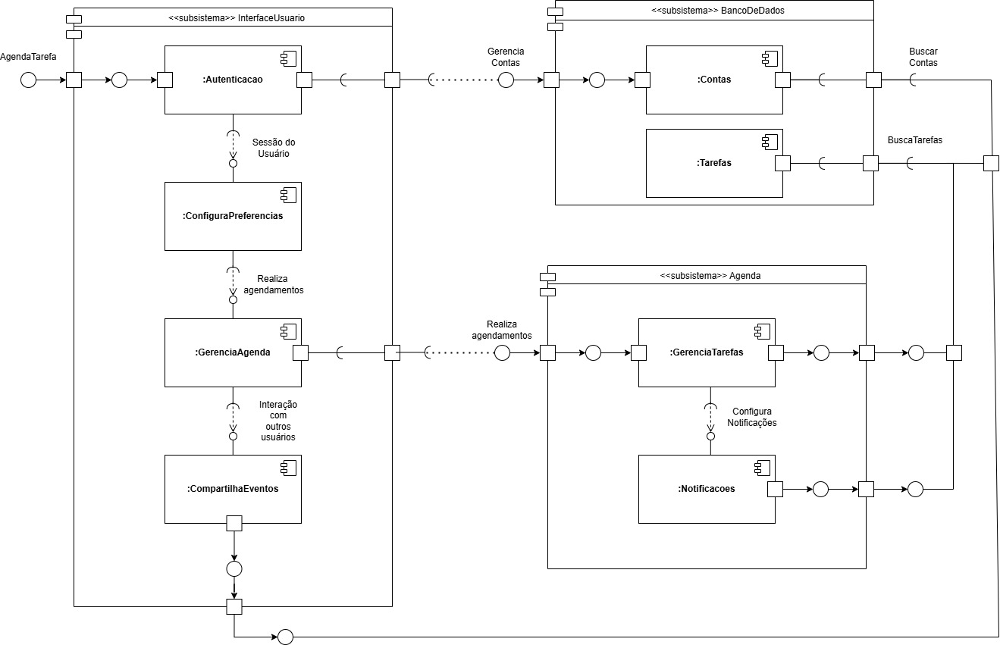
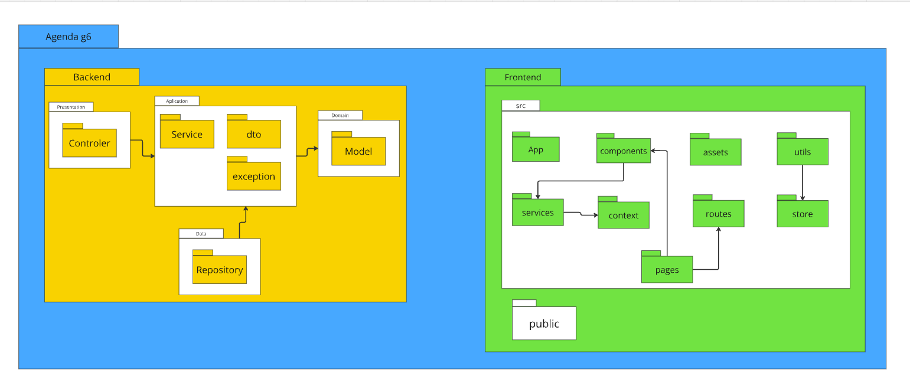
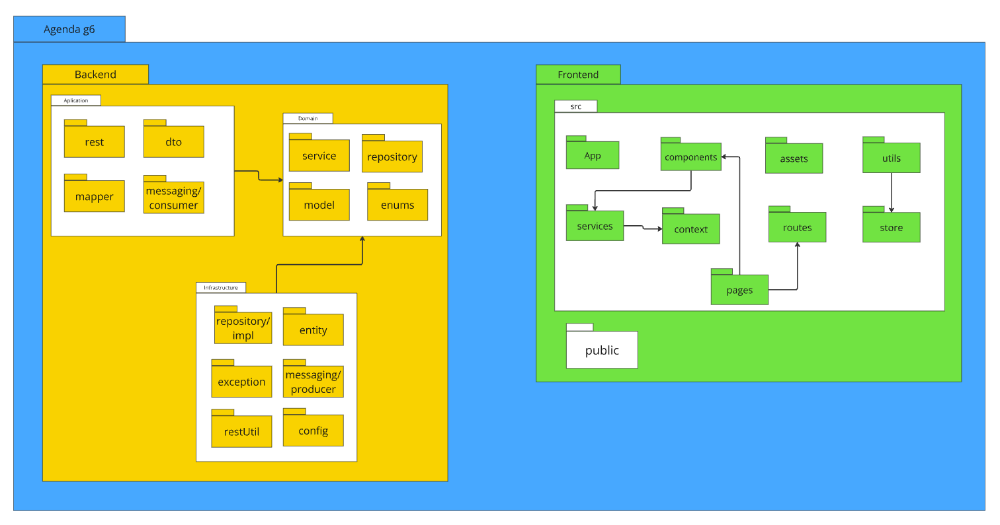

## 4.1.2. Representação Arquitetural

A representação arquitetural descreve como a arquitetura do sistema é organizada e representada, utilizando diferentes visões (como lógica, de processos, de implantação, etc.) para capturar os aspectos significativos do sistema. Ela é fundamental para entender a estrutura geral do sistema, como os componentes se relacionam e como as decisões arquiteturais impactam o desenvolvimento. Serve como um guia para a equipe de desenvolvimento e stakeholders.

 Diagrama de Componentes

<b>Autor:</b> [João Barreto](https://github.com/JoaoBarreto03), [Hugo Melo](https://github.com/melohugo), [Ricardo Augusto](https://github.com/avmricardo), [Danilo Carvalho](https://github.com/Danilo-Carvalho-Antunes), 2024

 <strong> Versão 1:</Strong> Diagrama de Pacotes - Agenda <gitbr>

<b>Autor:</b> [Carlos Alves](https://github.com/CADU110), [Hugo](https://github.com/melohugo), [Ricardo](https://github.com/avmricardo), [Bianca](https://github.com/BiancaPatrocinio7), [Vitor Feijó](https://github.com/vitorfleonardo), [Julia](https://github.com/juhvitoria4), [Yago](https://github.com/yagompassos), 2024

 <strong> Versão 2:</Strong> Diagrama de Pacotes - Agenda <gitbr>

<b>Autor:</b> [Ricardo Augusto](https://github.com/avmricardo), 2024

[Link para o miro.](https://miro.com/app/board/uXjVLAbgimw=/)

Esses diagramas mostram a estrutura do sistema em termos de componentes, pacotes e suas interações, que são aspectos fundamentais da arquitetura. Eles fornecem uma visão geral de como o sistema é organizado e como os módulos se comunicam.

---

## Referências

> <a>1.</a> Diagrama de Pacotes. Disponível em: [Diagrama de Pacotes](https://unbarqdsw2024-2.github.io/2024.2_G6_Agenda_Entrega_02/#/./foco3/d_pacotes).  
> <a>2.</a> Diagrama de Componentes. Disponível em: [Diagrama de Componentes](https://unbarqdsw2024-2.github.io/2024.2_G6_Agenda_Entrega_02/#/./foco1/d_componentes).   

## Histórico de Versão

| Versão | Data | Descrição | Autor(es) | Data de revisão | Revisor(es) |
| :-: | :-: | :-: | :-: | :-: | :-: |
| `1.0` | 02/02/2025  | Preenchimento inicial do artefato de Representação Arquitetural. | [Bianca](https://github.com/BiancaPatrocinio7)  | 02/02/2025  | [Carlos Alves](https://github.com/CADU110)|

---
