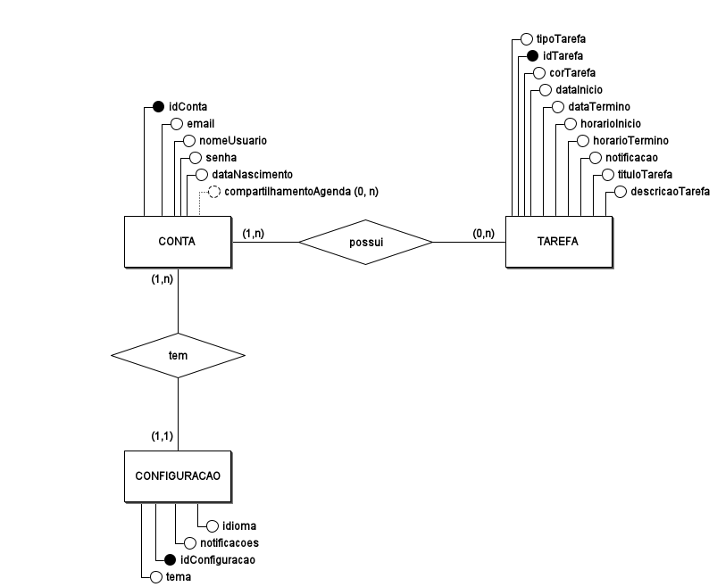
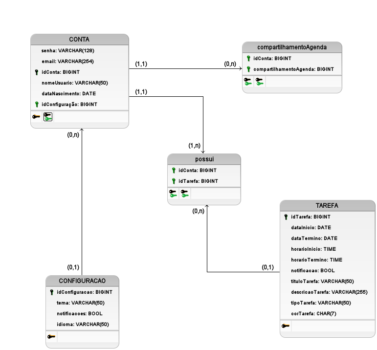

# **4.1.9. Visualização de Dados**

## **Introdução**
A **Visualização de Dados** representa a estrutura do banco de dados do sistema, abordando a organização, armazenamento e relacionamento dos dados. Esse nível de abstração fornece uma visão clara de como os dados são persistidos e manipulados, garantindo integridade, escalabilidade e eficiência na recuperação de informações.

Os principais artefatos utilizados nesta seção incluem:
- **Diagrama Entidade-Relacionamento (DER)** para modelagem conceitual dos dados.
- **Diagrama Lógico de Dados (DLD)** para estruturação da base de dados relacional.
- **Descrição dos Modelos de Dados**, incluindo atributos, chaves primárias e estrangeiras.

---

## **Diagrama Entidade-Relacionamento (DER)**

O **Diagrama Entidade-Relacionamento (DER)** apresenta uma visão conceitual dos dados, modelando as entidades do sistema e seus relacionamentos. Ele é essencial para a normalização do banco de dados e identificação das regras de negócio.

### **Descrição do DER**
- **Entidade `CONTA`**: Representa os usuários do sistema, contendo atributos como `idConta`, `email`, `senha`, `nomeUsuario` e `dataNascimento`. Possui um relacionamento 1:1 com `CONFIGURACAO` e 1:N com `TAREFA`.
- **Entidade `TAREFA`**: Representa os compromissos ou eventos agendados pelos usuários, contendo atributos como `idTarefa`, `tituloTarefa`, `descricaoTarefa`, `dataInicio`, `dataTermino`, `horarioInicio` e `horarioTermino`. Uma conta pode ter várias tarefas (1:N).
- **Entidade `CONFIGURACAO`**: Armazena as preferências do usuário, como idioma, tema e notificações. Relaciona-se 1:1 com `CONTA`.
- **Relação `possui`**: Representa a associação entre `CONTA` e `TAREFA`, indicando que um usuário pode possuir várias tarefas.
- **Entidade `compartilhamentoAgenda`**: Define a funcionalidade de compartilhamento entre usuários.

---

## **Diagrama Lógico de Dados (DLD)**

O **Diagrama Lógico de Dados (DLD)** apresenta uma visão detalhada do banco de dados relacional, incluindo tabelas, chaves primárias e estrangeiras, e seus relacionamentos.

### **Descrição do DLD**
- **Tabela `CONTA`**:
  - **Chave Primária**: `idConta`
  - **Campos**: `email`, `nomeUsuario`, `senha`, `dataNascimento`, `idConfiguracao`
  - **Relacionamentos**: Relacionada com `CONFIGURACAO` (1:1) e `TAREFA` (1:N).

- **Tabela `TAREFA`**:
  - **Chave Primária**: `idTarefa`
  - **Campos**: `tituloTarefa`, `descricaoTarefa`, `dataInicio`, `dataTermino`, `horarioInicio`, `horarioTermino`, `notificacao`, `tipoTarefa`, `corTarefa`
  - **Relacionamentos**: Relacionada com `CONTA` através da tabela associativa `possui`.

- **Tabela `CONFIGURACAO`**:
  - **Chave Primária**: `idConfiguracao`
  - **Campos**: `tema`, `notificacoes`, `idioma`
  - **Relacionamentos**: Relacionada a `CONTA` em um relacionamento 1:1.

- **Tabela `possui`** (tabela associativa):
  - **Chaves Primárias**: `idConta`, `idTarefa`
  - **Relaciona** `CONTA` com `TAREFA` (1:N).

- **Tabela `compartilhamentoAgenda`**:
  - **Chaves Primárias**: `idConta`, `compartilhamentoAgenda`
  - **Relaciona** usuários que compartilham agendas.

---

## **Estrutura de Tabelas**
Abaixo está um resumo da modelagem relacional do banco de dados:

| Tabela                   | Atributos Principais                                      | Chave Primária       | Relacionamentos              |
|--------------------------|---------------------------------------------------------|----------------------|------------------------------|
| `CONTA`                  | `idConta`, `email`, `senha`, `nomeUsuario`              | `idConta`            | 1:1 com `CONFIGURACAO`, 1:N com `TAREFA` |
| `TAREFA`                 | `idTarefa`, `tituloTarefa`, `descricaoTarefa`           | `idTarefa`           | N:1 com `CONTA` via `possui` |
| `CONFIGURACAO`           | `idConfiguracao`, `tema`, `notificacoes`, `idioma`      | `idConfiguracao`     | 1:1 com `CONTA`             |
| `possui`                 | `idConta`, `idTarefa`                                   | (`idConta`, `idTarefa`) | Associação entre `CONTA` e `TAREFA` |
| `compartilhamentoAgenda` | `idConta`, `compartilhamentoAgenda`                     | (`idConta`, `compartilhamentoAgenda`) | Relacionamento entre contas |

---

## **Conclusão**
A **Visualização de Dados** demonstra como as informações são estruturadas no sistema, desde o modelo conceitual até a implementação no banco de dados. A modelagem garante:
- **Organização eficiente** dos dados.
- **Relacionamentos bem definidos** entre as entidades.
- **Integridade referencial**, garantindo consistência na manipulação dos dados.
- **Escalabilidade**, permitindo futuras expansões sem comprometer a base atual.

---

## **Histórico de Versão**
| Versão | Data | Descrição | Autor(es) | Data de revisão | Revisor(es) |
| :-: | :-: | :-: | :-: | :-: | :-: |
| `1.0` | 02/02/2025  | Criação do artefato de Visualização de Dados | [Johnny Lopes](https://github.com/JohnnyLopess) &  [João Barreto](https://github.com/JoaoBarreto03) | 02/02/2025 | [Bianca](https://github.com/BiancaPatrocinio7) |